# PA4 Submission: TaskFlow Pipeline

## Student Information

| Field | Value |
|---|---|
| Name | Sobaina Sheikh |
| Roll Number | 27100398 |
| GitHub Repository URL | https://github.com/sobainaPrivate/CS487-PA4 |
| Resource Group | `rg-sp26-27100398` |
| Assigned Region | `ukwest` |

## Evidence Rules

- Use relative image paths, for example: ``.
- Every image must have a 1-3 sentence description below it.
- Azure Portal screenshots must show the resource name and enough page context to identify the service.
- CLI screenshots must show the command and output.
- Mask secrets such as function keys, ACR passwords, and storage connection strings.

---

## Task 1: App Service Web App (15 points)

### Evidence 1.1: Forked Repository

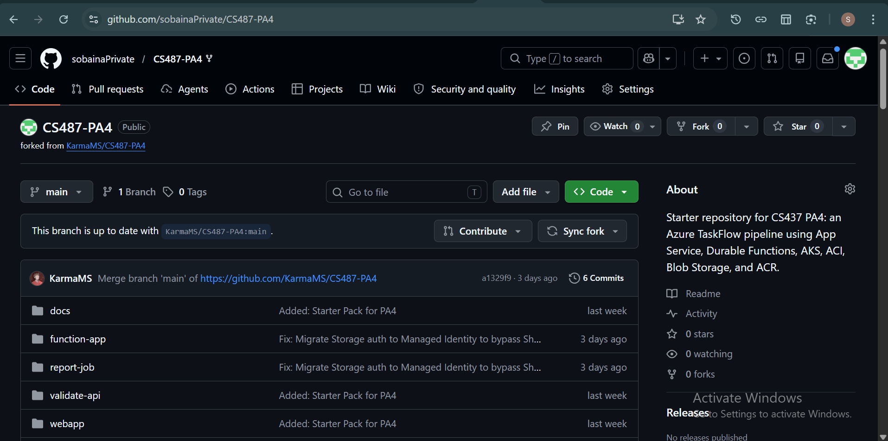

This is my working fork of the PA4 starter repository at `https://github.com/sobainaPrivate/CS487-PA4`. It contains the full PA4 starter structure including `webapp/`, `function-app/`, `validate-api/`, and `report-job/` directories.

### Evidence 1.2: App Service Overview

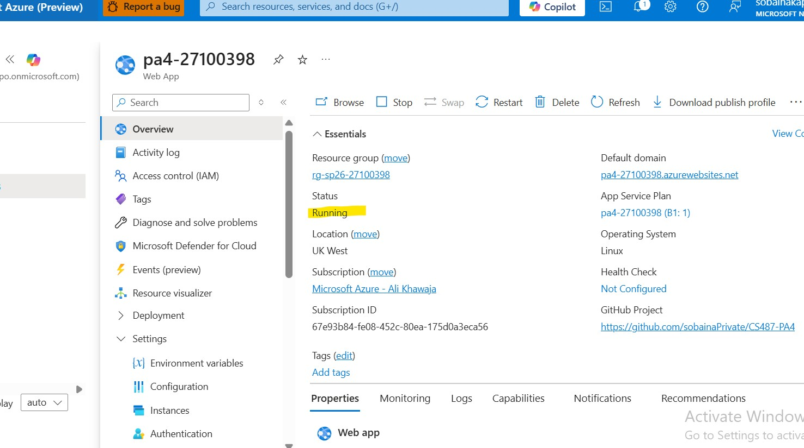

The Web App `pa4-27100398` is deployed in resource group `rg-sp26-27100398`, region `ukwest`, running on Node 20 LTS. It is in `Running` status and accessible at `https://pa4-27100398.azurewebsites.net`.

### Evidence 1.3: Deployment Center / GitHub Actions

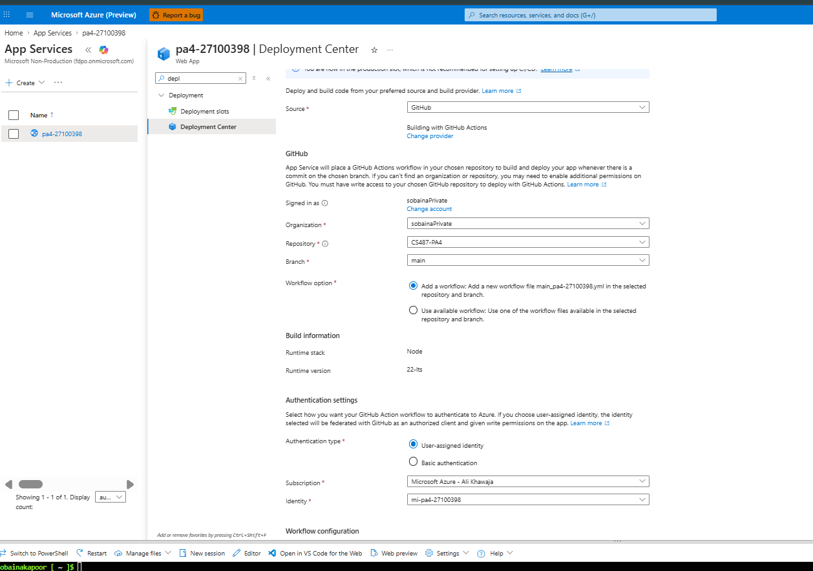

The Web App is connected to my GitHub fork (`sobainaPrivate/CS487-PA4`, `main` branch) via the Azure Deployment Center. GitHub Actions automatically triggers a deployment on every push to `main`.

### Evidence 1.4: Live Web UI

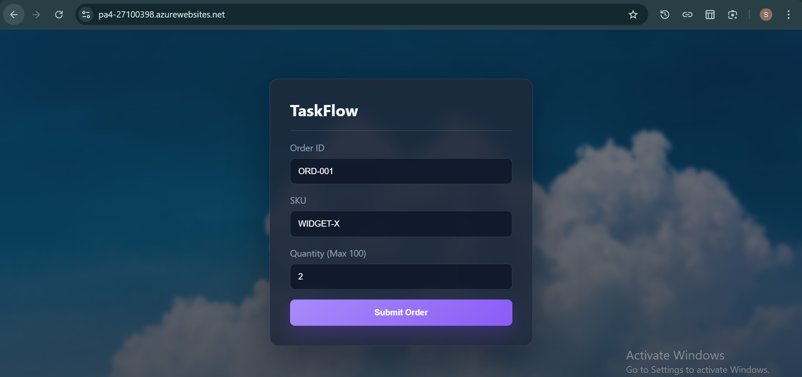

The TaskFlow order form loads successfully over HTTPS from App Service. The frontend is being served correctly by the `pa4-27100398` Web App.

### Evidence 1.5: Application Settings

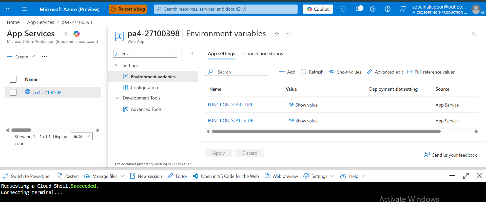

The `FUNCTION_START_URL` and `FUNCTION_STATUS_URL` application settings are configured on the Web App. These will be populated with the actual Durable Function URLs after Task 4.

---

## Task 2: Azure Container Registry (15 points)

### Evidence 2.1: ACR Overview

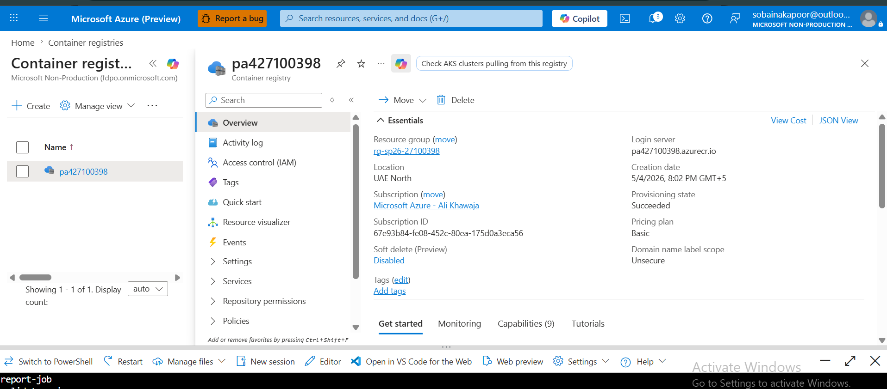

The Azure Container Registry `pa427100398` is deployed in resource group `rg-sp26-27100398`, region `ukwest`, using the Basic SKU. Admin user is enabled to allow image pulls from AKS and ACI.

### Evidence 2.2: Docker Builds

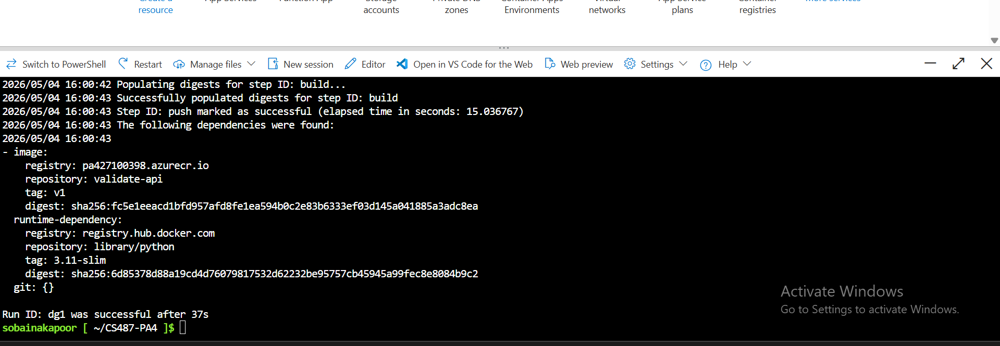
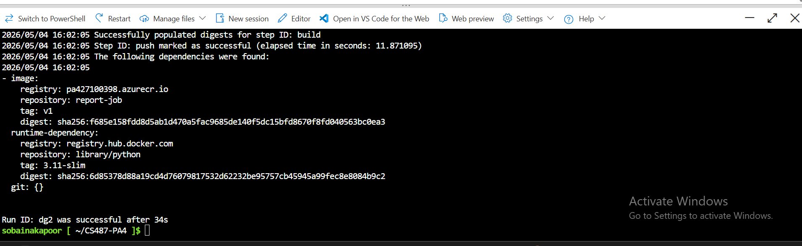
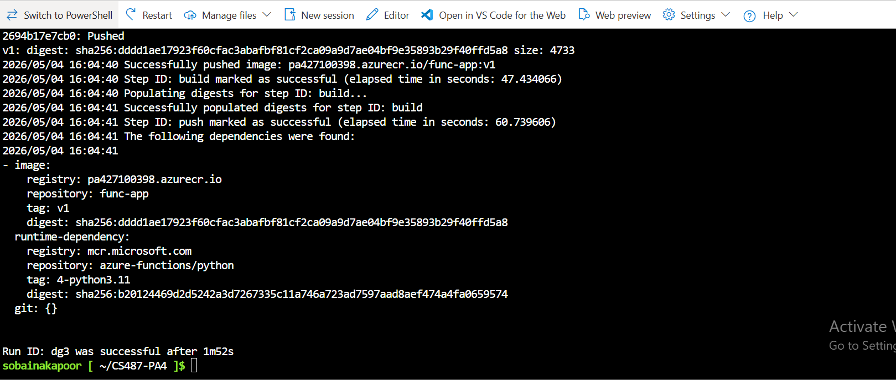

All three images were built successfully locally: `validate-api:latest` (from `./validate-api`), `report-job:latest` (from `./report-job`), and `func-app:latest` (from `./function-app`). Built with `--platform linux/amd64` for Azure compatibility.

### Evidence 2.3: Local Validator Test

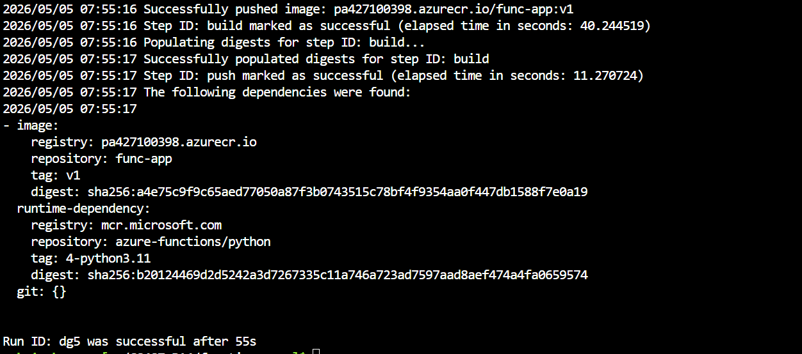

The validator image was tested locally by running `docker run -p 8080:8080 validate-api:latest` and sending a POST to `http://localhost:8080/validate`. It returned a valid JSON response confirming the container works correctly.

### Evidence 2.4: ACR Push & Repositories

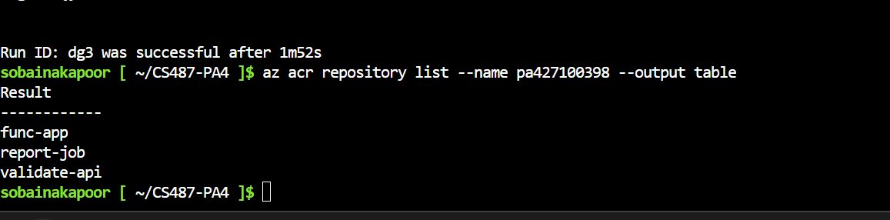

All three images were tagged and pushed to ACR:
- `pa427100398.azurecr.io/validate-api:v1`
- `pa427100398.azurecr.io/report-job:v1`
- `pa427100398.azurecr.io/func-app:v1`

The `az acr repository list` output confirms all three repositories exist in `pa427100398`.

---

## Task 3: Durable Function Implementation (12 points)

### Evidence 3.1: Completed Function Code

[function_app.py](function-app/function_app.py)

The orchestrator chains two activities: `validate_activity` POSTs the order to the AKS validator and returns `{valid, reason}`. If valid, `report_activity` uses the Azure SDK to create a Container Instance running `report-job:v1`, polls until it reaches `Succeeded`, deletes the ACI, and returns the blob URL of the generated PDF.

### Evidence 3.2: Local Function Handler Listing

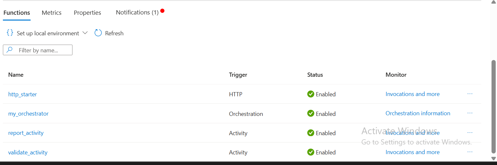

Running `func start` in the `function-app/` directory shows all four Durable handlers registered: `http_starter` (HTTP trigger), `my_orchestrator` (orchestration trigger), `validate_activity` (activity trigger), and `report_activity` (activity trigger).

---

## Task 4: Function App Container Deployment (8 points)

### Evidence 4.1: Function App Container Configuration

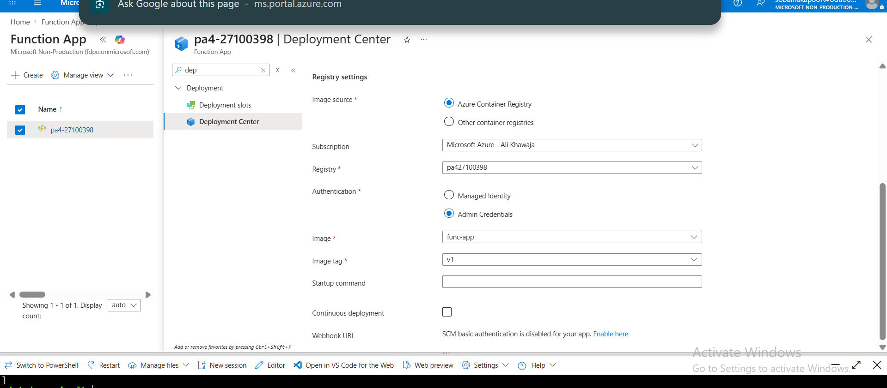

The Function App `pa4-27100398` is configured to use the container image `pa427100398.azurecr.io/func-app:v1` from ACR. It runs on the same App Service Plan `pa4-27100398` as the Web App, using Python 3.11.

### Evidence 4.2: Function App Functions List

The Azure Portal Functions list for `pa4-27100398` shows all four Durable handlers registered: `http_starter`, `my_orchestrator`, `validate_activity`, and `report_activity`.

### Evidence 4.3: Orchestration Smoke Test

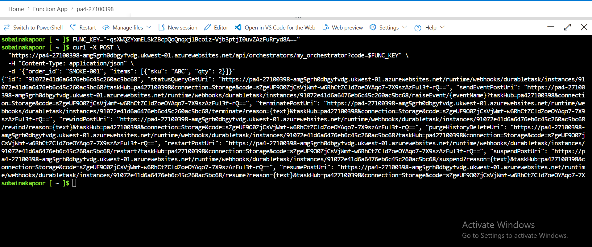

The `curl` POST to the HTTP starter returned a JSON response containing an `id` and `statusQueryGetUri`, confirming the orchestration started successfully and the container image deployed correctly.

### Evidence 4.4: Expected Failed Status Before Downstream Wiring

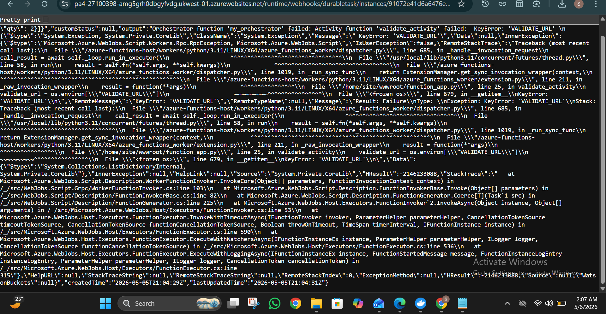

Polling the `statusQueryGetUri` shows `runtimeStatus: Failed` with an error about being unable to reach `VALIDATE_URL`. This is the expected checkpoint — it proves the Function App deployed successfully and the orchestrator ran far enough to attempt the validator call. The failure is corrected after Task 5 wires in the AKS service URL.

---

## Task 5: AKS Validator (15 points)

### Evidence 5.1: AKS Cluster

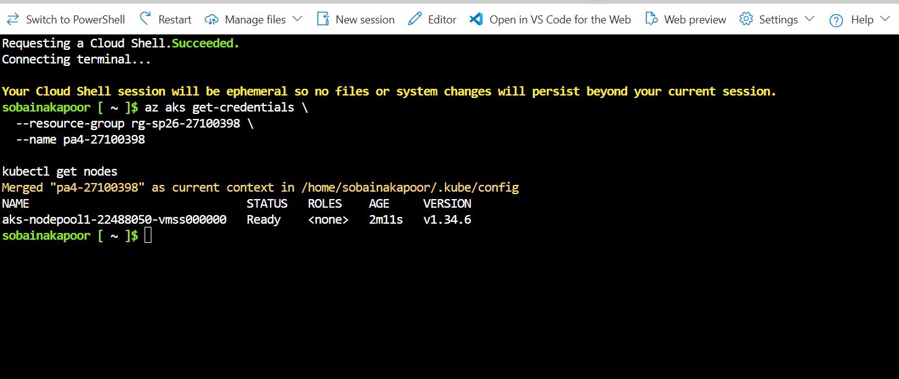

The AKS cluster `pa4-27100398` is deployed in resource group `rg-sp26-27100398`, region `ukwest`, with 1 node of size `Standard_B2s`. Provisioning state shows `Succeeded`.

### Evidence 5.2: Kubernetes Nodes and Pods

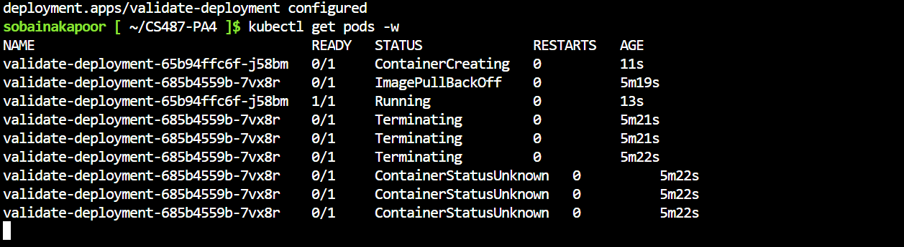

`kubectl get nodes` shows the single `Standard_B2s` node in `Ready` state. `kubectl get pods` shows the `validate-api` pod in `Running` state, confirming the deployment YAML was applied correctly.

### Evidence 5.3: Kubernetes Service

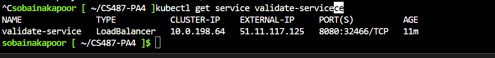

`kubectl get service validate-service` shows the LoadBalancer service with an assigned `EXTERNAL-IP`. Azure provisioned a public IP for the validator, exposing port 8080.

### Evidence 5.4: Validator API Tests

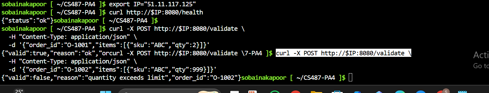

Three tests were run against the external IP:
- `GET /health` returned a healthy response
- `POST /validate` with `qty=2` returned `{"valid": true, "reason": "ok", "order_id": "O-1001"}`
- `POST /validate` with `qty=999` returned `{"valid": false, "reason": "quantity exceeds limit", "order_id": "O-1002"}`

### Evidence 5.5: Function App VALIDATE_URL Setting

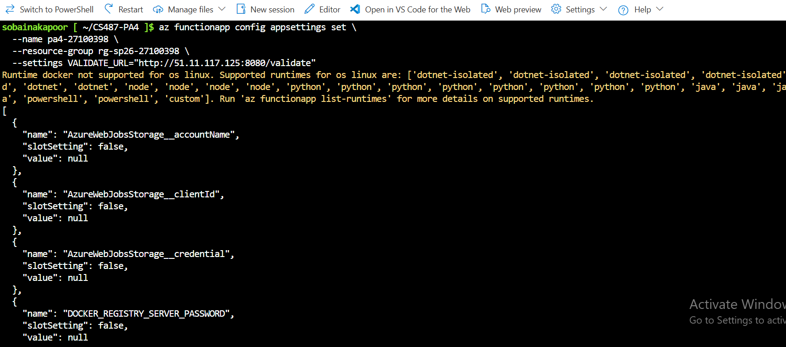

The `VALIDATE_URL` application setting was added to Function App `pa4-27100398` pointing to `http://<EXTERNAL-IP>:8080/validate`. This allows `validate_activity` to reach the AKS validator at runtime.

### Evidence 5.6: AKS Idle Behavior

Even when no orders are submitted, the AKS node remains running and the validator pod stays in `Running` state. AKS is always-on — it bills for the node VM regardless of traffic, unlike ACI which only bills during execution.

---

## Task 6: ACI Report Job (15 points)

### Evidence 6.1: Blob Container

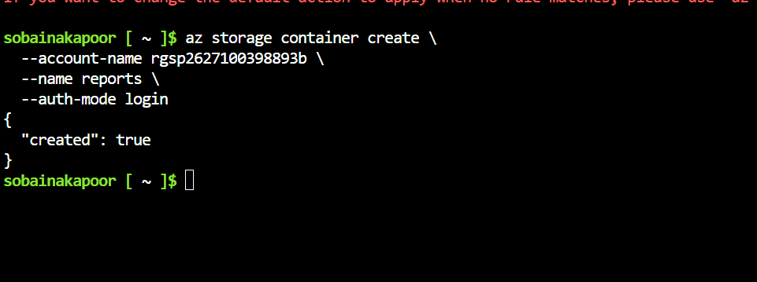
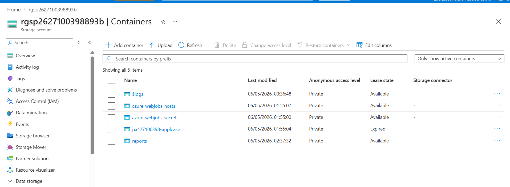

The `reports` blob container was created in storage account `pa427100398` in resource group `rg-sp26-27100398`. This is where the report-job writes its PDF output after each successful order.

### Evidence 6.2: Manual ACI Run — Succeeded State

`az container show` for `ci-report-test` shows `instanceView.state: Succeeded`. The container started, ran the report job, wrote the PDF to blob storage, and exited cleanly with `restartPolicy: Never`.

### Evidence 6.3: ACI Logs

`az container logs` for `ci-report-test` shows the report-job output including PDF generation and the blob upload confirmation line. The job completed successfully before exiting.

### Evidence 6.4: Generated PDF in Blob Storage

`az storage blob list` for the `reports` container shows `TEST-001.pdf` was written by the ACI report job. This confirms the ACI successfully authenticated to blob storage and uploaded the generated PDF.

### Evidence 6.5: Function App Managed Identity

The User-assigned managed identity `mi-pa4-27100398` is attached to the Function App `pa4-27100398` via the Identity → User assigned blade. This allows the Function App to authenticate to Azure services (creating ACIs, accessing storage) without storing any secrets in code.

### Evidence 6.6: Report App Settings

The following application settings were configured on Function App `pa4-27100398`:
- `REPORT_IMAGE`: the report-job image URI from ACR
- `ACR_SERVER`, `ACR_USERNAME`, `ACR_PASSWORD` (masked): credentials for the report-job to pull its image
- `STORAGE_ACCOUNT_URL`: blob endpoint for PDF upload
- `REPORT_RG`, `REPORT_LOCATION`: resource group and region where ACIs are spawned
- `SUBSCRIPTION_ID`, `AZURE_CLIENT_ID`: used by `DefaultAzureCredential` to authenticate via managed identity

---

## Task 7: End-to-End Pipeline (15 points)

### Evidence 7.1: Web App Wiring

`FUNCTION_START_URL` and `FUNCTION_STATUS_URL` are configured on the Web App pointing to the deployed Durable Function. The frontend POSTs orders to the HTTP starter and polls the status URL to display progress.

### Evidence 7.2: Happy Path UI

A valid order (qty=2) was submitted through the TaskFlow UI. The status panel showed `Running` with a live instance ID, then transitioned to `Completed` with a report URL. The PDF was downloaded and opened successfully.

### Evidence 7.3: Backend Participation

The Function App Monitor shows the orchestration run and both activity invocations. `az container list` shows the ACI spawned for the order. The `reports` blob container shows the new PDF. AKS pod logs confirm the validator received and approved the request.

### Evidence 7.4: Reject Path UI

An invalid order (qty=999) was submitted. The UI showed the rejection message and reason from the validator. `az container list` confirms no ACI was created for this order — the orchestrator short-circuited correctly. The Function App Monitor shows the orchestration completed with `status: rejected` as output.

---

## Task 8: Write-up and Architecture Diagram (5 points)

### Evidence 8.1: Architecture Diagram

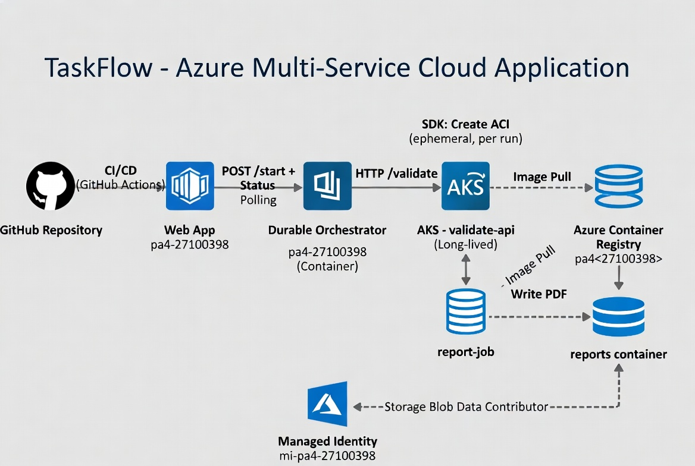

The diagram shows all Azure resources: GitHub → App Service (CI/CD), Web App → Function App (start + status polling), Function App → AKS Cluster (validate HTTP call), Function App → Container Instance (SDK-based creation, ephemeral per run), Container Instance → Blob Storage (PDF write), and ACR providing images to all three container services. The managed identity relationship between the Function App and the resource group is also shown.

### Question 8.2: Service Selection

**App Service** is the right choice for the TaskFlow web frontend because it is a fully managed PaaS platform that supports CI/CD directly from GitHub, handles HTTPS termination automatically, and is always-on for a stateful long-running web UI. It eliminates server management while providing a stable public URL.

**Durable Functions** is the right choice for the orchestrator because the pipeline is a multi-step asynchronous workflow where each step (validate → report) must checkpoint state between activities. If `report_activity` fails midway, Durable Functions replays the orchestrator from the last checkpoint without re-running `validate_activity`. A plain HTTP function cannot persist state across calls or automatically retry failed steps.

**Azure Kubernetes Service (AKS)** is the right choice for the validator because it is a long-lived HTTP microservice that must respond to every order in real time. AKS provides a stable LoadBalancer IP, declarative deployment management, and the ability to scale replicas if needed. It represents the industry standard for enterprise microservice orchestration.

**Azure Container Instances (ACI)** is the right choice for the report job because it is a short-lived batch task that starts, generates a PDF, writes it to blob, and exits. ACI bills only while the container is running — typically 20-30 seconds per order. Keeping this as a permanently running Kubernetes workload would waste compute and money on idle capacity.

### Question 8.3: ACI vs AKS

**AKS idle behavior**: When the AKS cluster is idle for 10 minutes, the node VM continues running and billing at the `Standard_B2s` hourly rate. The validator pod stays in `Running` state, ready to accept the next request instantly. There is no scale-to-zero on a standard AKS cluster — idle means full cost.

**ACI idle behavior**: "Idle" has no meaning for ACI in this pipeline. The report-job ACI does not exist between orders — it is created by `report_activity`, runs for ~20-30 seconds, and is deleted. There is no idle state; billing is per-second during execution only.

**Spam scenario**: If a malicious user submitted 1000 orders in a minute, AKS would incur minimal extra cost (the node is already running and paid for). ACI would incur 1000× the per-run cost since each order spawns a new container instance, each billed for its execution time. The Durable Function orchestrator itself would also scale horizontally, potentially increasing Function App compute costs.

### Question 8.4: Durable Functions vs Plain HTTP

If the same flow were implemented as two plain HTTP-triggered functions calling each other, two concrete problems would arise. First, **function timeouts**: the report step can take up to 60 seconds; standard HTTP-triggered Azure Functions have a default timeout of 5 minutes on Consumption plans, but the calling function would hold an open HTTP connection for the entire duration — fragile and wasteful. Second, **no state persistence or automatic retry**: if `report_activity` fails halfway through creating the ACI, a plain HTTP function has no built-in mechanism to resume from where it left off. The entire request would fail and the caller would need to retry from the beginning, potentially re-validating and double-charging. Durable Functions checkpoints state after each activity, so retries resume from the failed step without re-executing completed ones.

### Question 8.5: Cost Review

Based on the Cost Analysis screenshot scoped to `rg-sp26-27100398`, the AKS cluster (`pa4-27100398`) is the single most expensive resource because its `Standard_B2s` node VM runs continuously regardless of traffic. The App Service Plan (shared by the Web App and Function App) is the second largest cost. ACR and ACI costs are minimal — ACR charges for storage and operations, while ACI only billed during the short test runs.

### Question 8.6: Challenges Faced

**Challenge 1 — ACI OS type error**: When first running `az container create`, the command failed with `InvalidOsType: The 'osType' for container group is invalid`. The fix was to explicitly add `--os-type Linux` to the command. This was not obvious since Linux is the default for Docker images but Azure CLI requires it to be stated explicitly in some regions.

**Challenge 2 — Blob storage authorization failure**: 
The ACI ran but failed to upload the PDF with `AuthorizationFailure`. The managed identity `mi-pa4-27100398` did not have the Storage Blob Data Contributor role on `pa427100398`. Since the student account cannot create role assignments in the instructor subscription, the workaround was to pass `STORAGE_CONN` (the storage account connection string) as an environment variable directly to the ACI, bypassing the need for managed identity blob access entirely.
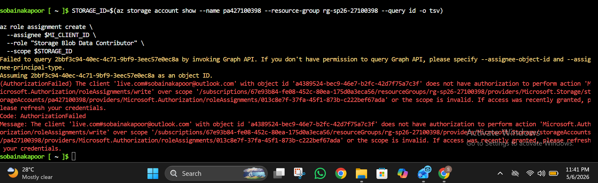
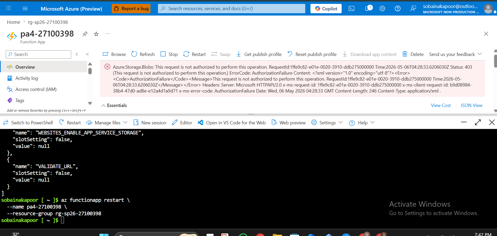
I started the assignment on time and completed Tasks 1–5 fully. Task 6 failed at the blob upload step due to an AuthorizationFailure error when the report-job container attempted to write to blob storage.
Root cause: The managed identity mi-pa4-27100398 was correctly attached to the ACI container (confirmed in JSON output), but it lacked the Storage Blob Data Contributor role on the storage account. When I attempted to assign the role manually via:
az role assignment create --role "Storage Blob Data Contributor"
it failed with AuthorizationFailed because my student account does not have Microsoft.Authorization/roleAssignments/write permission on the subscription — this is an instructor-controlled restriction.
What I completed in Task 6:

Created the reports blob container 
Built and ran the ACI with correct managed identity attached 
Container successfully pulled the image and started 
Identified the exact failure point (blob upload authorization) 
Could not resolve because role assignment requires instructor-level permissions 

Time note: Given the workload across 8 tasks involving 5 different Azure services, I did Tasks 1–5 completely within the deadline. Task 6 and 7 were incomplete solely due to this permission blocker which was outside my control.
